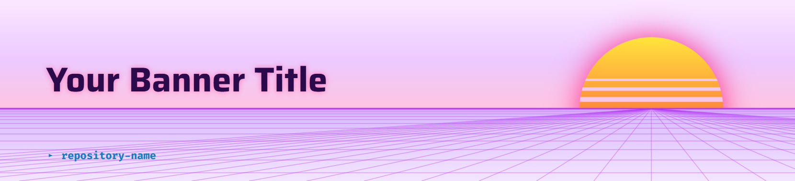

<picture>
  <source media="(prefers-color-scheme: dark)" srcset="art/header-dark.png">
  
</picture>

# Rachid Arb
### Software Engineer · Java Full-Stack Developer

  <strong>Building resilient, test-driven backend architectures and reactive full-stack web applications.</strong>

  
  
  
  

  <code>Java 21 LTS</code> &nbsp;•&nbsp;
  <code>Spring Boot 3</code> &nbsp;•&nbsp;
  <code>Spring Security</code> &nbsp;•&nbsp;
  <code>PostgreSQL</code> &nbsp;•&nbsp;
  <code>React</code> &nbsp;•&nbsp;
  <code>TypeScript</code> &nbsp;•&nbsp;
  <code>Docker</code> &nbsp;•&nbsp;
  <code>Clean Architecture</code> &nbsp;•&nbsp;
  <code>Automated Testing</code>

---

## 📌 About Me

I am a **Software Engineer** specializing in the **Java & Spring ecosystem**, with hands-on experience building production-oriented full-stack web applications and concurrent network systems.

* ⚙️ **Backend Engineering**: Designing robust RESTful APIs with **Spring Boot 3**, implementing layered domain architectures, managing relational data persistence with **PostgreSQL**, **Hibernate**, and **Flyway**, and securing endpoints with stateless **JWT** authentication.
* 💻 **Full-Stack Execution**: Connecting clean backends to responsive client applications using **React**, **TypeScript**, and modern UI frameworks.
* 🧪 **Testing & Quality Assurance**: Practicing test-driven verification across unit, integration, and end-to-end layers using **JUnit 5**, **Mockito**, **MockMvc**, and **Vitest**.
* 🌐 **Systems & Distributed Fundamentals**: Working beyond high-level abstractions with multi-threaded **TCP/UDP socket protocols**, binary object serialization, **Java RMI**, and event streaming with **Apache Kafka**.
* 🎯 **Current Focus**: Microservices architecture, reactive streams, high-throughput caching, and container orchestration with Docker.
* 💼 **Open To**: Junior to Mid-level **Software Engineer**, **Java Backend Developer**, and **Full-Stack Developer** opportunities.

---

## 🛠️ Technology Stack

<table>
  <tr>
    <td width="20%"><strong>Backend & Core</strong></td>
    <td>
      
      
      
      
      
      
      
    </td>
  </tr>
  <tr>
    <td width="20%"><strong>Frontend & UI</strong></td>
    <td>
      
      
      
      
      
      
    </td>
  </tr>
  <tr>
    <td width="20%"><strong>Databases & Storage</strong></td>
    <td>
      
      
      
      
      
      
    </td>
  </tr>
  <tr>
    <td width="20%"><strong>Testing & Quality</strong></td>
    <td>
      
      
      
      
      
    </td>
  </tr>
  <tr>
    <td width="20%"><strong>Distributed & Networking</strong></td>
    <td>
      
      
      
      
      
    </td>
  </tr>
  <tr>
    <td width="20%"><strong>DevOps & Tooling</strong></td>
    <td>
      
      
      
      
      
      
    </td>
  </tr>
</table>

---

## 🚀 Featured Engineering Projects

### 1. Enterprise Task Management System (Flagship)
> **Production-grade collaborative platform with layered clean architecture, stateless JWT security, and multi-stage Docker containerization.**

* **Problem Solved**: Provides multi-tenant task orchestration, team governance, and activity audit trails with strict authorization fences.
* **Tech Stack**: `Java 21 LTS` • `Spring Boot 3.3.5` • `PostgreSQL 16` • `React 18` • `TypeScript` • `Tailwind CSS` • `Docker Compose` • `Flyway` • `GitHub Actions`
* **Architecture & Engineering Highlights**:
  * **Clean Domain Layering**: Decoupled Controllers, Business Services, Persistence Repositories, DTOs, and Domain Entities.
  * **Security by Design**: Stateless HMAC-SHA256 signed JWT Bearer authentication with `BCrypt` (cost factor 12) password encryption and custom method-level security (`@PreAuthorize`).
  * **Access Control**: Strict project membership data fences preventing cross-project resource exposure.
  * **Database Versioning**: Deterministic schema evolution and index management via **Flyway** (`V1__init_schema.sql`).
  * **Comprehensive Testing**: **114 backend automated tests** (64 Mockito unit tests + 50 MockMvc integration tests) with 100% pass rate, plus **7 Vitest frontend tests** and **12 end-to-end verification flows**.
  * **Production DevOps**: Multi-stage Docker builds, Nginx reverse proxy configuration, unprivileged container user execution, and an automated GitHub Actions CI pipeline with real PostgreSQL test services.
* **Links**: [Source Code Repository](https://github.com/RachidArb/enterprise-task-management-system) • [Interactive API Docs (OpenAPI 3)](https://github.com/RachidArb/enterprise-task-management-system#api-documentation-swagger--openapi-3)

---

### 2. Hospital Patient Management System
> **Healthcare management application built on Spring Boot MVC and relational data persistence.**

* **Problem Solved**: Streamlines hospital patient record management, consultation tracking, and medical record lifecycles.
* **Tech Stack**: `Java` • `Spring Boot` • `Spring Data JPA` • `Hibernate` • `Thymeleaf` • `H2 / MySQL` • `Bootstrap`
* **Engineering Highlights**:
  * Clean **MVC architecture** separating web controller routing, service boundaries, and template rendering.
  * Server-side dynamic HTML rendering and pagination using **Thymeleaf**.
  * Entity relationship modeling and query abstraction using **Spring Data JPA**.
  * Data validation, server-side error feedback, and parameterized database queries.
* **Links**: [Source Code Repository](https://github.com/RachidArb/Hospital-Management-Application-Spring-Boot-Thymeleaf)

---

### 3. Java Distributed Systems & Network Socket Suite
> **Low-level network client-server systems demonstrating concurrency, binary serialization, and RPC mechanisms.**

* **Problem Solved**: Demonstrates fundamental distributed communication protocols beneath modern enterprise abstractions.
* **Tech Stack**: `Java (Core/JVM)` • `Multithreading` • `TCP Sockets` • `UDP Datagrams` • `Java RMI` • `Object Serialization`
* **Engineering Highlights**:
  * **Concurrent TCP Server**: Multithreaded server managing simultaneous client connections and stateful registration sessions.
  * **Binary Object Streaming**: Object transmission over network boundaries using `ObjectInputStream` and `ObjectOutputStream`.
  * **Remote Method Invocation (RMI)**: Distributed object invocation utilizing RMI registries, remote interfaces, and stubs.
  * **UDP Datagram Services**: Low-overhead request-response and echo messaging protocols.
* **Links**:
  * [TCP Socket Registration System](https://github.com/RachidArb/TCP-Socket-Registration-System-Using-Serializable-Objects)
  * [TCP Client-Server Object Transfer](https://github.com/RachidArb/Java-TCP-Sockets-with-Serializable-Object-Transfer)
  * [Java RMI Architecture](https://github.com/RachidArb/RMI-Remote-Method-Invocation-)

---

### 4. Event-Driven Stream Processing with Apache Kafka
> **Distributed pub/sub messaging and real-time event stream processing.**

* **Problem Solved**: Real-time event ingestion and aggregation pipelines using distributed partitions.
* **Tech Stack**: `Java` • `Apache Kafka` • `Zookeeper` • `Maven`
* **Engineering Highlights**:
  * Asynchronous event producers and consumers handling high-throughput messaging.
  * Real-time WordCount streaming application processing unbounded message streams.
  * Topic partitioning, consumer group rebalancing, and cluster coordination via Zookeeper.
* **Links**: [Source Code Repository](https://github.com/RachidArb/Apache-kafka)

---

### 5. Library Management System (Decoupled SPA & REST API)
> **Modern full-stack web application featuring an asynchronous REST API backend with a high-performance React SPA.**

* **Problem Solved**: Centralized inventory tracking, reservation workflows, and administrative management.
* **Tech Stack**: `React 19` • `TypeScript / JavaScript` • `Vite` • `Tailwind CSS` • `RESTful API` • `SQLite`
* **Engineering Highlights**:
  * Decoupled client-server contract with responsive component hierarchy.
  * Complete CRUD operational model for inventory and reservation lifecycle tracking.
* **Links**: [Source Code Repository](https://github.com/RachidArb/Syst-me-de-Gestion-de-Biblioth-que)

---

## 🏛️ Engineering Principles & Standards

* **Clean Architecture & SOLID**: Separation of domain rules from infrastructure, frameworks, and delivery mechanisms.
* **Test-Driven Reliability**: Automated unit testing for business invariants (Mockito) and integration slice testing for HTTP/persistence layers (MockMvc).
* **Defense-in-Depth Security**: Stateless authentication, parameterized queries to prevent SQL injection, role-based method guards, and hardened Docker runtimes.
* **Predictable Database Migrations**: Versioned database migrations with Flyway for reliable deployments and schema integrity across environments.
* **Automated CI/CD**: Automated testing, linting, and container build verification on every commit via GitHub Actions.

---

## 📊 GitHub Analytics

  
  &nbsp;&nbsp;
  

---

## 📬 Connect & Collaborate

| Channel | Contact Point |
|---|---|
| **LinkedIn** | [linkedin.com/in/[ADD-YOUR-HANDLE]](https://linkedin.com/in/[ADD-YOUR-HANDLE]) |
| **Email** | [[ADD YOUR EMAIL]](mailto:[ADD YOUR EMAIL]) |
| **GitHub** | [github.com/RachidArb](https://github.com/RachidArb) |
| **Location** | [ADD YOUR LOCATION] *(Open to Relocation & Remote Roles)* |

